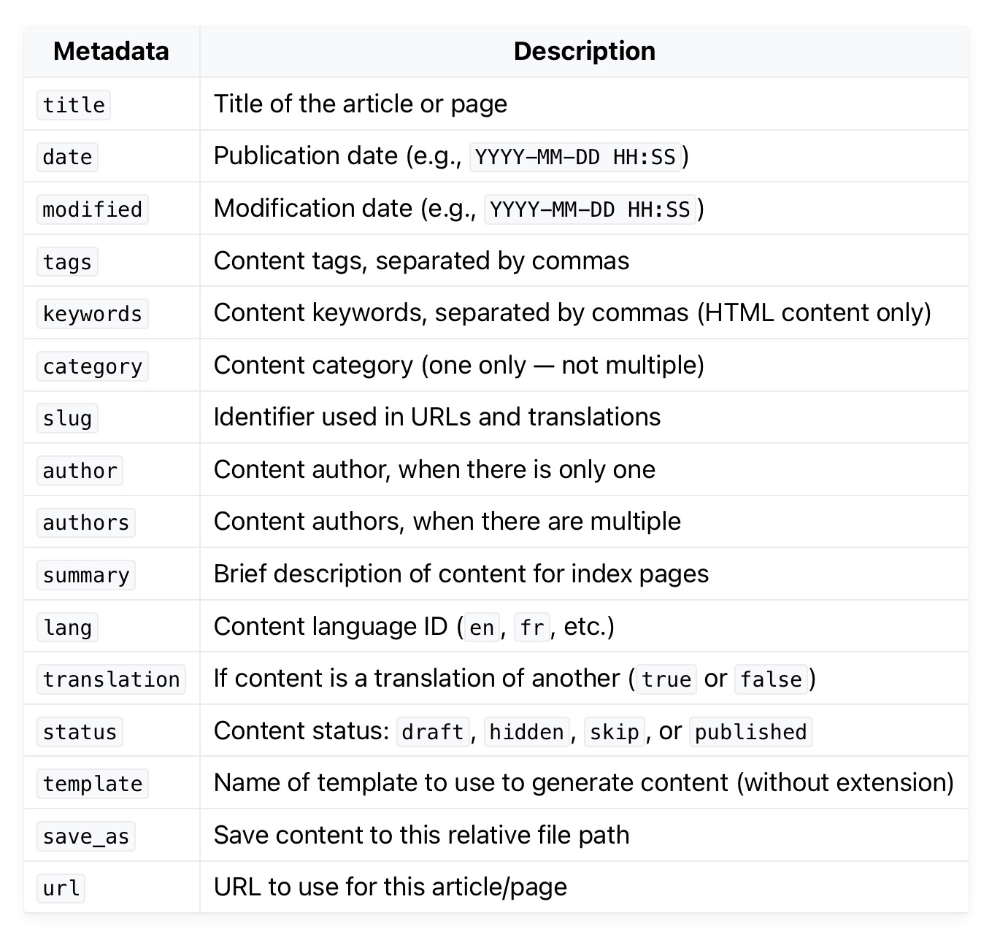

Title: My 2nd Post
Date: 2025-09-05
Category: テクノロジー

これは私の２番目の投稿です。

## Pelicanのメタデータについて

以上の中から必要に応じて使用します。

## Pelicanのメタデータとその利点

Pelicanでは、Markdownファイルの先頭に`Title`や`Date`といった「メタデータ」を記述します。これらは記事の本文そのものではなく、記事に関する「情報」です。

!IMG

このメタデータを使うことで、以下のような多くの利点があります。

*   **コンテンツの自動整理**: `Category`や`Tags`を指定すると、Pelicanが自動でカテゴリ別・タグ別のアーカイブページを生成してくれます。
*   **URLの最適化**: `Slug`メタデータを使えば、記事のURLを分かりやすくカスタマイズできます。
*   **表示の制御**: `Summary`メタデータで記事一覧に表示する要約を自由に設定できます。
*   **テーマとの連携**: テーマはこれらのメタデータを読み取り、著者名や公開日を適切な場所に表示します。

このように、メタデータはサイトの構造化と自動化の要となる重要な機能です。

